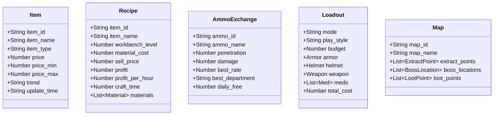
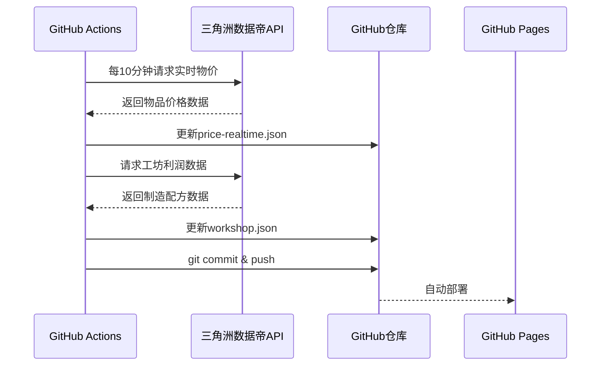
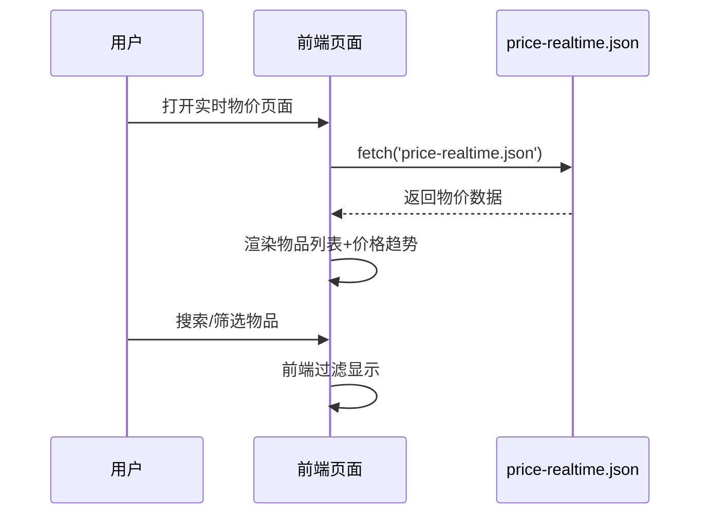

# 三角眼工具站系统架构设计文档

**版本**：V1.0  
**日期**：2026年5月12日  
**架构师**：齐活林（主理人代高见远）  
**基于**：《三角眼工具站产品迭代需求文档 V1.0》

---

## 1. 实现方案与框架选型

### 1.1 架构决策：**渐进式静态站点架构**

经过分析，我建议**不立即迁移到前后端分离架构**，而是采用**渐进式升级方案**：

| 阶段 | 架构 | 说明 |
|------|------|------|
| **当前→P1需求** | 静态站点 + GitHub Actions | 复用现有代码，快速交付 |
| **P1需求完成后** | 评估是否引入React | 根据用户体验需求决定 |
| **长期生态阶段** | 前后端分离（可选） | 如果需要社区、战绩等功能 |

### 1.2 技术选型

#### 前端层
- **当前（P0-P1阶段）**：静态HTML + Vanilla JavaScript + Tailwind CSS
  - 理由：快速交付，复用现有代码，GitHub Pages直接托管
  - 缺点：交互复杂时会比较难维护
  
- **未来（长期生态阶段）**：Vite + React + MUI + Tailwind CSS
  - 理由：组件化开发，易维护，适合复杂交互（社区、战绩）
  - 迁移时机：P1需求完成，用户量增长到需要更好体验时

#### 数据层
- **当前**：JSON文件（GitHub仓库内）
  - 更新方式：GitHub Actions定时抓取API数据
  - 优点：免费，版本控制，简单易维护
  - 缺点：不适合大规模用户数据（社区、战绩）

- **未来（如果需要）**：
  - 数据库：PostgreSQL（用户数据、社区内容）
  - 缓存：Redis（热点数据缓存）
  - 对象存储：OSS/COS（用户上传的图片）

#### 自动化层
- **GitHub Actions**（已完成）
  - 每10分钟：更新实时物价、工坊利润
  - 每小时：更新子弹兑换、智能配装
  - 每日：更新历史价格、数据校验

#### 数据源
- **主数据源**：三角洲数据帝API（orzrice.com）
- **备用数据源**：官方小程序API、开源社区API

---

## 2. 文件列表

| 文件路径 | 用途 | 状态 | 说明 |
|----------|------|------|------|
| **已有文件（复用）** | | | |
| `scripts/fetch-*.js` | API数据抓取脚本 | ✅ 已完成 | 5个脚本，无需修改 |
| `.github/workflows/update-data.yml` | GitHub Actions工作流 | ✅ 已完成 | 4个job |
| `price-realtime.json` | 实时物价数据 | ✅ 生成中 | API自动更新 |
| `workshop.json` | 工坊利润数据 | ✅ 生成中 | API自动更新 |
| **P0阶段新增/修改** | | | |
| `js/data-validator.js` | 数据校验工具 | 🆕 新建 | 交叉校验、异常检测 |
| `js/s9-data.js` | S9赛季基准数据 | 🆕 新建 | 手动录入的准确数据 |
| `utils/calculator.js` | 修正后的计算公式 | 🔄 修改 | 工坊利润、子弹兑换 |
| `maps/s9/` | S9赛季地图数据 | 🆕 新建 | 撤离点、首领位置 |
| **P1阶段新增** | | | |
| `js/price-tracker.js` | 价格走势展示 | 🆕 新建 | 7天/30天历史曲线 |
| `js/loadout-generator.js` | 一键配装生成器 | 🆕 新建 | 基于预算/模式/玩法 |
| `maps/interactive/` | 半互动地图 | 🆕 新建 | 缩放、标记、点击查看 |
| **中期阶段新增** | | | |
| `js/gun-smith.js` | 改枪模拟器 | 🆕 新建 | 配件属性模拟 |
| `js/price-alert.js` | 价格提醒 | 🆕 新建 | 浏览器通知API |

---

## 3. 数据结构和接口（类图）



---

## 4. 程序调用流程（时序图）

### 4.1 数据更新流程（GitHub Actions自动）



### 4.2 用户查询物价流程



---

## 5. 任务列表

### P0阶段：紧急修复（1-3天）

| 任务ID | 任务名称 | 依赖 | 状态 |
|--------|----------|------|------|
| Task #1 | 修复工坊利润计算公式 | - | ⏳ 待开始 |
| Task #2 | 录入S9赛季基准数据 | Task #1 | ⏳ 待开始 |
| Task #3 | 修正地图致命错误 | Task #2 | ⏳ 待开始 |
| Task #4 | 下架过时攻略内容 | - | ⏳ 待开始 |

### P1阶段：短期优化（1-2周）

| 任务ID | 任务名称 | 依赖 | 状态 |
|--------|----------|------|------|
| Task #5 | 对接实时物价API到前端 | Task #2 | ⏳ 待开始 |
| Task #6 | 升级静态地图为半互动地图 | Task #3 | ⏳ 待开始 |
| Task #7 | 优化工坊利润计算器 | Task #1 | ⏳ 待开始 |

### 中期阶段：功能开发（1个月）

| 任务ID | 任务名称 | 依赖 | 状态 |
|--------|----------|------|------|
| Task #8 | 开发一键配装系统 | Task #5 | ⏳ 待开始 |
| Task #9 | 开发改枪模拟器 | Task #5 | ⏳ 待开始 |
| Task #10 | 开发价格提醒功能 | Task #5 | ⏳ 待开始 |

---

## 6. 依赖包列表

```json
{
  "name": "sanjiaoy-tools",
  "version": "1.0.0",
  "description": "三角眼工具站 - 三角洲行动战备辅助工具",
  "scripts": {
    "fetch-prices": "node scripts/fetch-prices.js",
    "fetch-workshop": "node scripts/fetch-workshop.js",
    "fetch-ammo": "node scripts/fetch-ammo-exchange.js",
    "fetch-loadouts": "node scripts/fetch-loadouts.js",
    "fetch-history": "node scripts/fetch-price-history.js",
    "validate": "node scripts/validate-data.js"
  },
  "dependencies": {
    "axios": "^1.6.0"
  },
  "devDependencies": {},
  "engines": {
    "node": ">=18.0.0"
  }
}
```

---

## 7. 共享知识（跨文件约定）

### 7.1 命名规范

| 类型 | 规范 | 示例 |
|------|------|------|
| 文件名 | kebab-case | `price-realtime.json`, `loadout-generator.js` |
| JavaScript函数 | camelCase | `calculateProfit()`, `fetchPrices()` |
| CSS类名 | kebab-case | `.price-trend-up`, `.loadout-card` |
| 常量 | UPPER_SNAKE_CASE | `API_BASE_URL`, `MAX_PAGE_SIZE` |
| 变量 | camelCase | `itemPrice`, `totalCost` |

### 7.2 代码风格

- 缩进：2空格
- 引号：单引号（JavaScript）、双引号（JSON）
- 分号：JavaScript中使用分号
- 注释：JSDoc格式（函数）、//（单行）

### 7.3 数据格式约定

| 数据类型 | 格式 | 示例 |
|----------|------|------|
| 日期时间 | ISO 8601 | `2026-05-12T12:30:00.000Z` |
| 价格 | 整数（分） | `228000` = 2280.00元 |
| 百分比 | 小数 | `0.87` = 87% |
| 布尔值 | true/false | JSON原生格式 |

### 7.4 Git Commit规范

```
feat: 新功能
fix: 修复bug
docs: 文档更新
style: 代码格式（不影响功能）
refactor: 重构
test: 测试相关
chore: 构建/工具相关
```

---

## 8. 待明确事项

### 8.1 需要用户确认

1. **API Token配置**：是否已成功配置ORZRICE_TOKEN到GitHub Secrets？
2. **S9赛季数据来源**：基准数据从哪个渠道获取？
   - 官方公告？
   - 三角洲数据帝API？
   - 手动调研？
3. **优先级排序**：先做Task #1-4（P0），还是Task #5-7（P1）并行？

### 8.2 技术决策待定

1. **地图技术选型**：
   - 方案A：Leaflet.js（开源，成熟）
   - 方案B：Mapbox GL JS（更强大，需API Key）
2. **数据存储方案**：
   - 当前：JSON文件（免费，版本控制）
   - 未来：如果需要用户数据，考虑PostgreSQL

### 8.3 外部依赖

1. **三角洲数据帝API**：
   - Token申请地址：https://orzrice.com
   - 需要用户手动配置到GitHub Secrets
2. **GitHub Actions**：
   - 工作流已创建，需要启用
   - 需要配置ORZRICE_TOKEN Secret

---

## 9. 里程碑

| 里程碑 | 目标日期 | 任务 |
|--------|----------|------|
| M1: P0紧急修复完成 | 2026-05-15 | Task #1-4 |
| M2: P1短期优化完成 | 2026-05-26 | Task #5-7 |
| M3: 中期功能上线 | 2026-06-12 | Task #8-10 |

---

**文档状态**：V1.0  
**下一步**：派发Task #1给工程师寇豆码实施
